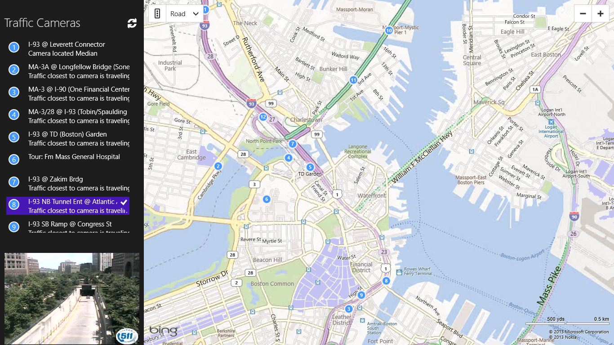

#APIMASH TomTom/BingMaps Starter Kit
##Date: 5.16.2013
##Version: v1.0.0
##Author(s): Jim O'Neil
##URL: http://github.com/apimash/starterkits

----------
###Description
The TomTom/BingMaps Starter Kit is a XAML/C# Windows Store application that demonstrates a mashup of BingMaps with the Traffic Cams API provided by [TomTom][10].  The application has been built to easily overlay and display locality-based information obtained from other APIs.

###Features
 - Incorporates [Bing Maps for Windows Store][2] control and invokes a the [Bing Maps Find a Location by Query REST API][3]
 - Invokes the [TomTom Traffic Cameras API][1]
 - Demonstrates how to deserialize both XAML and JSON to C#
 - Provides a baseline for a Windows Store App

###Requirements

 - Windows 8
 - [Visual Studio 2012 Express for Windows 8][6] or higher
 - [Bing Maps SDK for Windows Store apps][4] and [license key][7]
 - [JSON.NET][8]
 - [Mashery ID to access TomTom Developer Portal][9] and obtain API license key

###Setup

 - Download the [Starter Kit Zip Portfolio][5] 
 - Open the solution in Visual Studio
 - Compile and run

##DISCLAIMER: 
The sample code described herein is provided on an "as is" basis, without warranty of any kind, to the fullest extent permitted by law. Both Microsoft and I do not warrant or guarantee the individual success developers may have in implementing the sample code on their development platforms or in using their own Web server configurations. 

Microsoft and I do not warrant, guarantee or make any representations regarding the use, results of use, accuracy, timeliness or completeness of any data or information relating to the sample code. Microsoft and I disclaim all warranties, express or implied, and in particular, disclaims all warranties of merchantability, fitness for a particular purpose, and warranties related to the code, or any service or software related thereto. 

Microsoft and I shall not be liable for any direct, indirect or consequential damages or costs of any type arising out of any action taken by you or others related to the sample code.

##Change Log
###v1.0.0

[1]: http://developer.tomtom.com/docs/read/traffic_cameras "TrafficCam API"
[2]:http://msdn.microsoft.com/en-us/library/hh846481.aspx "Bing Maps for Windows Store Apps"
[3]:http://msdn.microsoft.com/en-us/library/ff701711.aspx "Find a Location by Query"
[4]:http://visualstudiogallery.msdn.microsoft.com/bb764f67-6b2c-4e14-b2d3-17477ae1eaca?SRC=Featured "Bing Maps SDK"
[5]:http://apimash.github.io/StarterKits "APIMASH Starter Kits"
[6]:http://www.microsoft.com/visualstudio/eng/products/visual-studio-express-for-windows-8 "Visual Studio 2012 Express for Windows 8"
[7]:http://msdn.microsoft.com/en-us/library/ff428642.aspx "Getting a Bing Maps Key"
[8]:http://json.codeplex.com "JSON.NET"
[9]:http://developer.tomtom.com/member "Register for TomTom API keys"
[10]:http://www.tomtom.com "TomTom"
