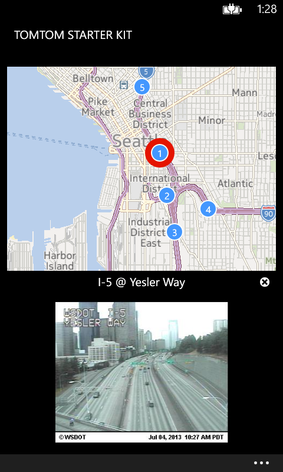

#APIMASH TomTom Starter Kit for Windows Phone
##Date: 7.4.2013
##Version: v1.0.0
##Author(s): Jim O'Neil
##URL: http://github.com/apimash/starterkits

----------
###Description
The TomTom Starter Kit is a XAML/C# Windows Phone 8 map-based application that overlays locations of traffic cameras across the US and Canada as provided by [TomTom][1].  The application has been built to easily display geocoded points-of-interest obtained from other APIs.

###Features
 - Invokes the [TomTom Traffic Cameras API][2]
 - Demonstrates how to deserialize XML to C#
 - Provides a baseline for a Windows Phone 8 App

###Requirements

 - Windows 8 (64-bit Professional version or higher)
 - [Visual Studio 2012 Express for Windows Phone][3] or higher
 - [Mashery ID to access TomTom Developer Portal][4] and obtain API license key

###Setup

 - Download the [Starter Kit Zip Portfolio][5] 
 - Navigate to the **APIMASH\_TomTom\_StarterKit\_Phone** directory and open the solution there
 - Paste your TomTom Traffic Cam API key into designated portion of the **App.xaml** file

###Customization
This starter kit was built in a modular manner to make it easy to integrate just about any API that has elements exposing latitude and longitude. The map implementation already includes necessary 
logic for showing point-of-interest pins and marking your current location as determined by GPS.

The code includes "TODO" markers in the files to highlight what needs to be modified to accommodate a different geoencoded API as well as optional steps that can be used to further customize the application.  

Minimally, you'll need to do two things:

 1. Implement an API wrapper class for your chosen data provider (using the **APIMASH_TomTom.cs** code as a model)
 2. Modify **MainPage.xaml** and its code-behind to data bind to your API's view model, adapting the layout to show the details of the point-of-interest selected on the map.

##DISCLAIMER: 
The sample code described herein is provided on an "as is" basis, without warranty of any kind, to the fullest extent permitted by law. Both Microsoft and I do not warrant or guarantee the individual success developers may have in implementing the sample code on their development platforms or in using their own Web server configurations. 

Microsoft and I do not warrant, guarantee or make any representations regarding the use, results of use, accuracy, timeliness or completeness of any data or information relating to the sample code. Microsoft and I disclaim all warranties, express or implied, and in particular, disclaims all warranties of merchantability, fitness for a particular purpose, and warranties related to the code, or any service or software related thereto. 

Microsoft and I shall not be liable for any direct, indirect or consequential damages or costs of any type arising out of any action taken by you or others related to the sample code.

##Change Log
###v1.0.0

[1]:http://www.tomtom.com "TomTom"
[2]:http://developer.tomtom.com/docs/read/traffic_cameras "TrafficCam API"
[3]:http://www.microsoft.com/visualstudio/eng/products/visual-studio-express-for-windows-phone "Visual Studio 2012 Express for Windows Phone"
[4]:http://developer.tomtom.com/member "Register for TomTom API keys"
[5]:http://apimash.github.io/StarterKits "APIMASH Starter Kits"

