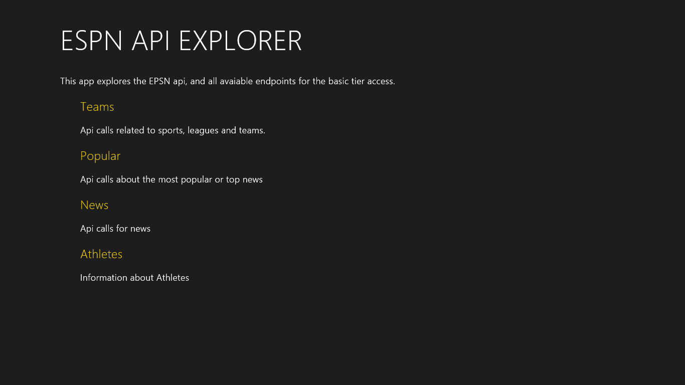
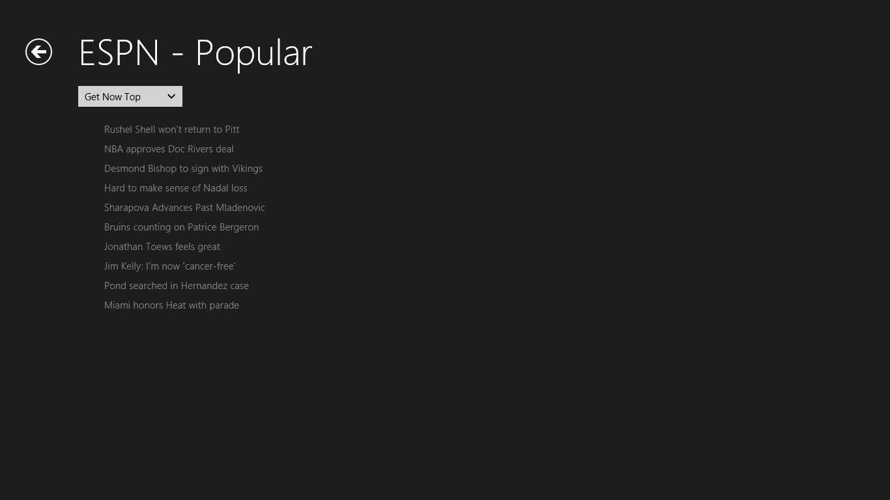
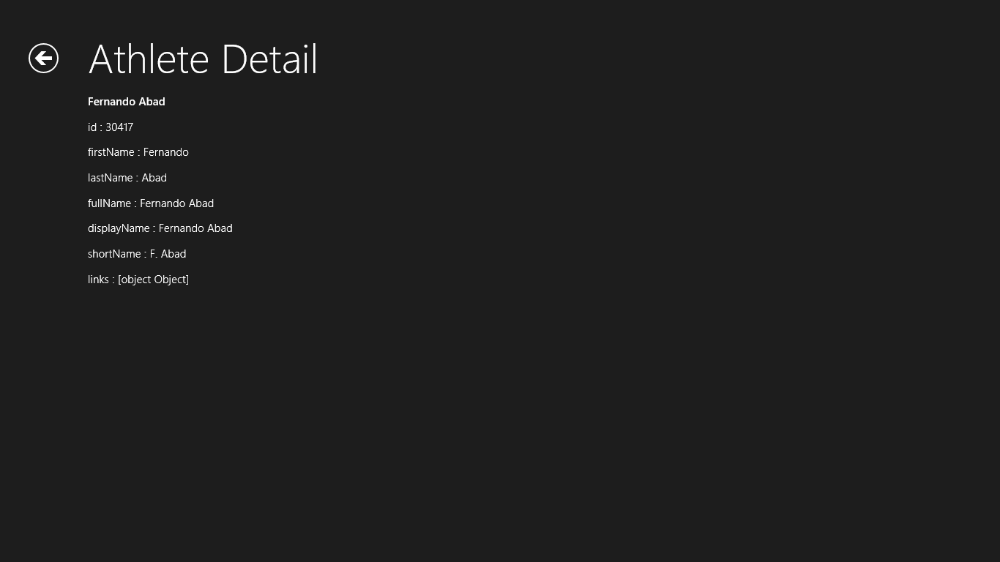

#APIMASH ESPN Starter Kit
##Date: 6.24.2013
##Version: v1.0.0
##Author(s): Stacey Mulcahy | @bitchwhocodes
##URL: http://github.com/apimash/starterkits

----------
###Description
The Foursquare Starter Kit uses the ESPN api and illustrates how to use many of the endpoints that do not require authorization. All calls do require an api key.
 
 
 
 

###Features
 - Invokes the ESPN API (http://developer.espn.com/docs). The good folks over at Mashery support this api, so you will need to get a mashery id. 
 - Enables various endpoints without oAuth - all top news, news, fantasy football, teams, and athletes endpoints 
 - Provides a baseline for a Windows 8 Store App
 - For API documentation, please see https://developer.foursquare.com

###Requirements

 - Windows 8
 - Visual Studio 2012 Express for Windows 8 or higher
 - Foursquare application key (apikey ) http://developer.espn.com/docs
 - Utilizes jQuery version 2.0.0 (http://code.jquery.com/jquery-2.0.0.js)

###Setup

 - Register with ESPN/Mashery to get an application key
 - Keep track of the application key
 - Download the Starter Kit Zip Portfolio from http://apimash.github.io/StarterKits/
 - Open the Solution in Visual Studio
 - Replace the [APPLICATION_KEY] variable in the js/apiglobals.js with your own application key
 - Compile and Run
 **NOTE**: You will need to add your own developer signing certificate to the project, by opening the package.appxmanifest file, and switching to the Packaging tab. On the packaging tab, click the "Choose Certificate..." button, and in the resulting dialog, click the "Configure Certificate..." drop-down, and select "Create test certificate..." then click OK to dismiss all dialogs, and save the app manifest file.

###Customization
This example exposes all the endpoints at their most basic level.Some endpoints have options or parameters to help tailor the result set, please refer to the documentation from ESPN. The example provided use the defaults.  Much of the data returned is quite rich, so please look at the documentation for result information

App Ideas:
- Who's on the sick/injured list? Determine which athletes are the sick/injured list and for how long. Could determine the athlete that has been out the longest.
- Top news updater - present the top news and by user selected sports to create a dashboard that is just for them
- Mashup with NYTimes etc to see what other publications have deemed as news worthy in sports

###Future Features

----------

##Change Log
###v1.0.1
- Modified readme

##DISCLAIMER: 
 
The sample code described herein is provided on an "as is" basis, without warranty of any kind, to the fullest extent permitted by law. Both Microsoft and I do not warrant or guarantee the individual success developers may have in implementing the sample code on their development platforms or in using their own Web server configurations. 
 
Microsoft and I do not warrant, guarantee or make any representations regarding the use, results of use, accuracy, timeliness or completeness of any data or information relating to the sample code. Microsoft and I disclaim all warranties, express or implied, and in particular, disclaims all warranties of merchantability, fitness for a particular purpose, and warranties related to the code, or any service or software related thereto. 
 
Microsoft and I shall not be liable for any direct, indirect or consequential damages or costs of any type arising out of any action taken by you or others related to the sample code.

