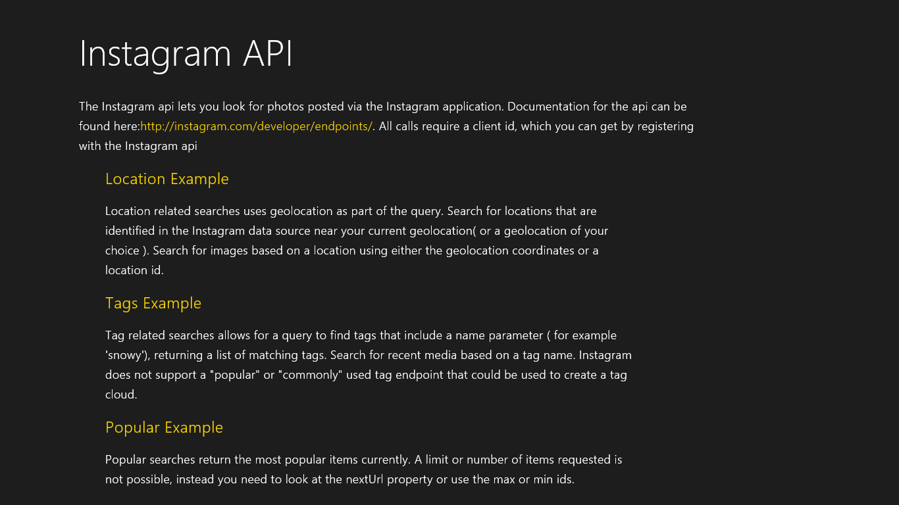
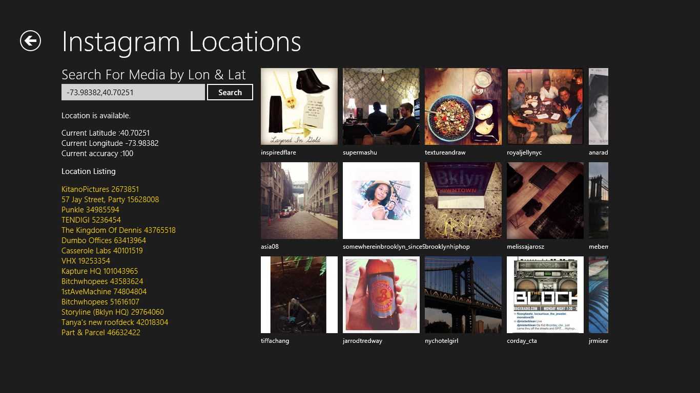
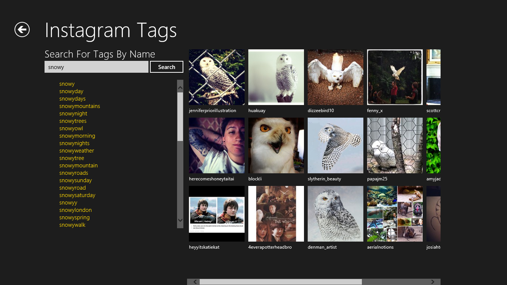

#APIMASH Instagram Starter Kit
##Date: 6.19.2013
##Version: v1.0.0
##Author(s): Stacey Mulcahy
##URL: http://github.com/apimash/starterkits

----------
###Description
The Instagram Starter Kit uses the Instagram api and illustrates how to use many of the endpoints that do not require authorization. All calls do require a client id however.
 
 
 
###Features
 - Invokes the Instagram API (http://instagram.com/developer/)
 - Enables various endpoints including tags, location, media and popular. 
 - Demonstrates how to use the winjs list component
 - Demonstrates how to determine the device's geolocation
 - Provides a baseline for a Windows 8 Store App
 - For API documentation, please see http://instagram.com/developer/

###Requirements

 - Windows 8
 - Visual Studio 2012 Express for Windows 8 or higher
 - Instagram application key ( client id ) http://instagram.com/developer/
 - Utilizes jQuery version 2.0.0 (http://code.jquery.com/jquery-2.0.0.js)

###Setup

 - Register with Instagram and register a new application ( http://instagram.com/developer/clients/manage/)
 - Keep track of the client id once you have registered.
 - Download the Starter Kit Zip Portfolio from http://apimash.github.io/StarterKits/
 - Open the Solution in Visual Studio
 - Replace the [CLIENT_ID] variable in the js/apiglobals.js with your own client id key
 - Compile and Run
 **NOTE**: You will need to add your own developer signing certificate to the project, by opening the package.appxmanifest file, and switching to the Packaging tab. On the packaging tab, click the "Choose Certificate..." button, and in the resulting dialog, click the "Configure Certificate..." drop-down, and select "Create test certificate..." then click OK to dismiss all dialogs, and save the app manifest file.

###Customization
This example exposes all the endpoints at their most basic level. Most of the endpoints do not have options, but a few do that include things like distance( for geolocation) or the max and min ideas for any endpoint that is getting recent media. Please see the Instagram API documentation - these parameters can be passed in through the calls via the options parameter, which is an object. 

As some photos do carry geolocation information with them ( its a user's preference to add geolocation), mash ups with Maps are ideal. This template also provides and easy way to aggregate and show photos tagged with a specific hashtag, or that are in a location - making it an ideal complement to apis such as Yelp, Foursquare and Meetup to name a few. 

App Ideas:
- InstaNear: Show instagram photos near the current location
- InstaShow: Create a slideshow viewer of most popular images or images that are tagged with something specific
- InstaExplorer: Randomly view photos by traversing their tags 
- InstaMap : Map locations and show photos taken in that location. Show who is the most prolific photographer. 
- Instatour - create a tour of an area through instagram photos

###Future Features

----------

##Change Log
###v1.0.1
- Modified readme

##DISCLAIMER: 
 
The sample code described herein is provided on an "as is" basis, without warranty of any kind, to the fullest extent permitted by law. Both Microsoft and I do not warrant or guarantee the individual success developers may have in implementing the sample code on their development platforms or in using their own Web server configurations. 
 
Microsoft and I do not warrant, guarantee or make any representations regarding the use, results of use, accuracy, timeliness or completeness of any data or information relating to the sample code. Microsoft and I disclaim all warranties, express or implied, and in particular, disclaims all warranties of merchantability, fitness for a particular purpose, and warranties related to the code, or any service or software related thereto. 
 
Microsoft and I shall not be liable for any direct, indirect or consequential damages or costs of any type arising out of any action taken by you or others related to the sample code.

