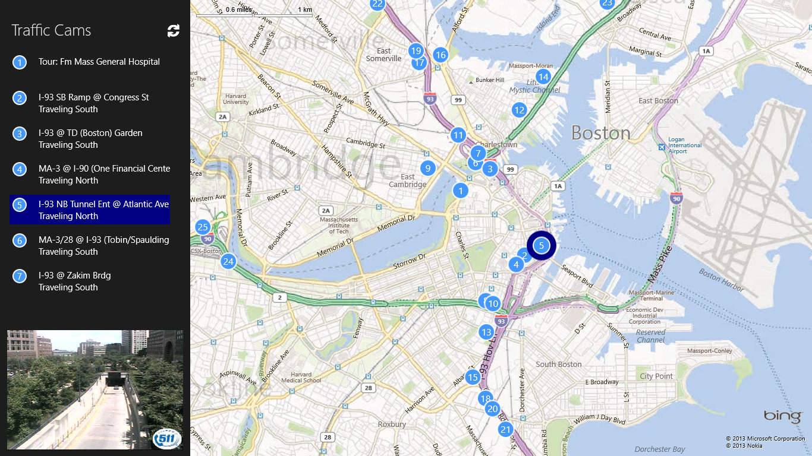
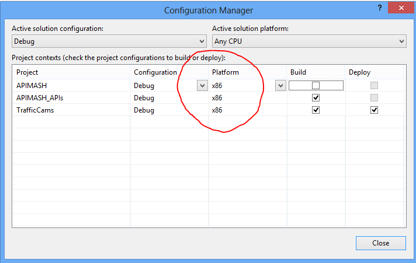

#APIMASH TomTom/BingMaps Starter Kit
##Date: 7.13.2013
##Version: v1.0.4
##Author(s): Jim O'Neil
##URL: http://github.com/apimash/starterkits

----------
###Description
The TomTom/BingMaps Starter Kit is a XAML/C# Windows Store application that demonstrates a mashup of BingMaps with the Traffic Cams API provided by [TomTom][10].  The application has been built to easily overlay and display locality-based information obtained from other APIs.

###Features
 - Incorporates [Bing Maps for Windows Store][2] control and invokes a the [Bing Maps Find a Location by Query REST API][3]
 - Invokes the [TomTom Traffic Cameras API][1]
 - Demonstrates how to deserialize both XAML and JSON to C#
 - Provides a baseline for a Windows Store App

###Requirements

 - Windows 8
 - [Visual Studio 2012 Express for Windows 8][6] or higher
 - [Bing Maps SDK for Windows Store apps][4] and [license key][7]
 - [JSON.NET][8]
 - [Mashery ID to access TomTom Developer Portal][9] and obtain API license key

###Setup

 - Download the [Starter Kit Zip Portfolio][5] 
 - Navigate to the **APIMASH\_TomTom\_BingMaps\__StarterKit** directory and open the solution there
 - In order to compile the application:
  - From within Visual Studio, install the *Bing Maps SDK for Windows Store Apps* by going to **Tools>Extensions and Updates...** and searching for "Bing Maps SDK" in the Visual Studio Gallery (or [download and install][11] separately)
  - In Visual Studio select **Tools>Options>Package Manager>General** and make sure *Allow NuGet to download missing packages during build* is checked
  - If you get an error indicating the build type of "Any CPU" is not supported, change the build configuration of the solution to "x86" as shown in the image below 
    
  - Paste your Bing Maps API and TomTom Traffic Cam API keys into designated portion of the **App.xaml** file

###Customization
This starter kit was built in a modular manner to make it easy to integrate just about any API that has elements exposing latitude and longitude. The Bing Maps implementation already includes necessary 
logic for showing point-of-interest pins, marking your current location as determined by GPS, and allowing a location search via a flyout accessible from the App Bar. The Search contract is also already
implemented with a landing pages showing the results and a static map snippet for each location found.

The code includes "TODO" markers in the files to highlight what needs to be modified to accomodate a different geo-encoded API as well as optional steps that can
be used to further customize the code.  At a high level, you'll need to minimally do three things:

 1. Implement an API wrapper class (using the **APIMASH_TomTom.cs** implementation as a model)
 2. Modify **LeftPanel.xaml** and its code-behind to data bind to your API's view model (and optionally adapt the layout). Note that **LeftPanel.xaml** is the requisite size for Window 8 snapped view, so no special adaptation is needed.
 3. Modify the **AboutFlyout**, **PrivacyFlyout**, and **SupportFlyout** to reflect your application

Upon store submission, you will need to create separate packages for each of the target architectures (ARM, x86, and x64) due to the reliance of the Bing Maps
control on a native C++ layer.

##DISCLAIMER: 
The sample code described herein is provided on an "as is" basis, without warranty of any kind, to the fullest extent permitted by law. Both Microsoft and I do not warrant or guarantee the individual success developers may have in implementing the sample code on their development platforms or in using their own Web server configurations. 

Microsoft and I do not warrant, guarantee or make any representations regarding the use, results of use, accuracy, timeliness or completeness of any data or information relating to the sample code. Microsoft and I disclaim all warranties, express or implied, and in particular, disclaims all warranties of merchantability, fitness for a particular purpose, and warranties related to the code, or any service or software related thereto. 

Microsoft and I shall not be liable for any direct, indirect or consequential damages or costs of any type arising out of any action taken by you or others related to the sample code.

###Change Log

1.0.1: added more detail to the Setup section and added Customization guidance

1.0.2: called out inclusion of Search contract

1.0.3: added screen shot of Configuration Manager

1.0.4: merged JSON class changes and MaxResults bugfix from boolship

[1]:http://developer.tomtom.com/docs/read/traffic_cameras "TrafficCam API"
[2]:http://msdn.microsoft.com/en-us/library/hh846481.aspx "Bing Maps for Windows Store Apps"
[3]:http://msdn.microsoft.com/en-us/library/ff701711.aspx "Find a Location by Query"
[4]:http://visualstudiogallery.msdn.microsoft.com/bb764f67-6b2c-4e14-b2d3-17477ae1eaca?SRC=Featured "Bing Maps SDK"
[5]:http://apimash.github.io/StarterKits "APIMASH Starter Kits"
[6]:http://www.microsoft.com/visualstudio/eng/products/visual-studio-express-for-windows-8 "Visual Studio 2012 Express for Windows 8"
[7]:http://msdn.microsoft.com/en-us/library/ff428642.aspx "Getting a Bing Maps Key"
[8]:http://json.codeplex.com "JSON.NET"
[9]:http://developer.tomtom.com/member "Register for TomTom API keys"
[10]:http://www.tomtom.com "TomTom"
[11]:http://visualstudiogallery.msdn.microsoft.com/bb764f67-6b2c-4e14-b2d3-17477ae1eaca "Bing Maps SDK for Windows Store Apps"
